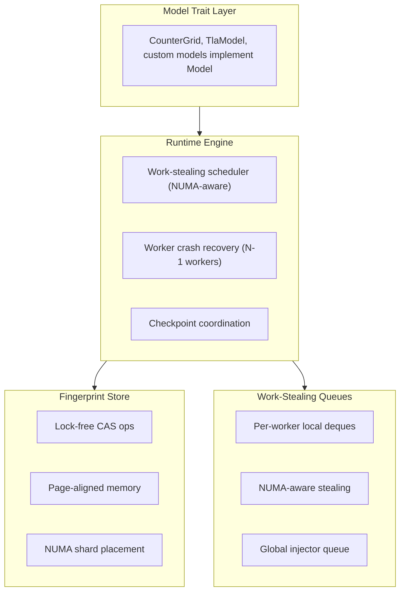

# CLAUDE.md

This file provides guidance to Claude Code (claude.ai/code) when working with code in this repository.

## Project Overview

`tlaplusplus` is a Rust implementation of TLA+ model checking, achieving **10.7x faster** state exploration than Java TLC on many-core systems (benchmarked on 128-core AMD EPYC, validated on 384-core systems with 6 NUMA nodes).

Key performance features:
- **Automatic NUMA-aware worker scaling** - detects NUMA topology and distances, auto-selects optimal worker count using only close NUMA nodes (distance ≤20)
- **NUMA-local memory allocation** - workers bind memory to their NUMA node via `set_mempolicy()`, achieving 99%+ user CPU (vs 60-70% without)
- **NUMA-aware work-stealing queues** - hierarchical stealing prefers same-NUMA-node workers, batch stealing reduces overhead
- **Lock-free fingerprint store** - atomic CAS operations eliminate lock contention
- **Zero-copy state handling** - Arc-wrapped collections avoid clone overhead
- **Batch fingerprint checking** - amortizes synchronization across 512+ states
- No GC pauses (native Rust memory management)
- Cgroup-aware worker sizing and memory budgeting

## Common Commands

### Build and Test

```bash
# Build release binary
cargo build --release

# Run all tests (103 tests)
cargo test

# Run with chaos/failpoint testing
cargo test --features failpoints

# Run property-based tests
cargo test proptests

# Run fuzzing (requires nightly)
cargo +nightly fuzz run fuzz_tla_module
```

### Running Model Checks

```bash
# Run synthetic counter-grid model (stress testing)
./target/release/tlaplusplus run-counter-grid \
  --max-x 10000 --max-y 10000 --max-sum 20000

# Analyze a TLA+ spec
cargo run -- analyze-tla \
  --module /path/to/Spec.tla \
  --config /path/to/Spec.cfg
```

### TLC Corpus Validation

```bash
# Run language coverage corpus
scripts/tlc_check.sh

# Run full indexed corpus
scripts/tlc_corpus.sh

# Run public corpus entries
scripts/tlc_public_corpus.sh
```

## Architecture

### Core Components



**1. Model Trait (`src/model.rs`)**
- Defines the interface all models must implement
- `Model::State` must be: Clone, Debug, Eq, Hash, Send, Sync, Serialize, DeserializeOwned
- Key methods: `initial_states()`, `next_states()`, `check_invariants()`

**2. Runtime Engine (`src/runtime.rs`)**
- Core parallel state exploration with N worker threads
- Uses `run_model()` as main entry point
- Coordinates workers, fingerprint store, state queues
- Worker crash recovery: continues with N-1 workers, redistributes work

**3. Storage Layer (`src/storage/`)**

**Lock-Free Fingerprint Store** (`page_aligned_fingerprint_store.rs`):
- Open-addressed hash table with atomic CAS operations
- 2MB page-aligned memory allocation for TLB efficiency
- NUMA-aware shard placement based on worker CPU affinity
- Bloom filter pre-check to reduce CAS operations
- Graceful degradation under memory pressure

**Work-Stealing Queues** (`work_stealing_queues.rs`):
- Per-worker lock-free deques (crossbeam-deque)
- Hierarchical NUMA-aware stealing:
  1. First try workers on same NUMA node (low latency, max 8 attempts)
  2. Then try remote NUMA nodes (max 1 attempt per node to minimize cross-NUMA traffic)
- Batch stealing via `steal_batch_and_pop()` reduces steal overhead
- Per-NUMA idle counters for O(NUMA_nodes) termination detection (vs O(workers))
- Cache-line padded counters to prevent false sharing
- Batch API: `push_local_batch()` for amortizing synchronization

**4. System Layer (`src/system.rs`, `src/storage/numa.rs`)**
- Cgroup-aware worker planning: reads `/sys/fs/cgroup` for cpuset and CPU quota
- NUMA topology detection from `/sys/devices/system/node`:
  - Discovers node count, CPU-to-node mappings, and inter-node distances
  - Auto-calculates optimal worker count based on NUMA distances (threshold ≤20)
  - On 6-NUMA-node systems, typically selects 3 close nodes for 2-4x better throughput
- NUMA-local memory binding via `set_mempolicy(MPOL_PREFERRED)` syscall
- CPU pinning via `sched_setaffinity`
- CPU list parsing (supports "2-127" or "2-63,96-127")
- Memory budget calculation from cgroup limits

**5. TLA+ Frontend (`src/tla/`)**

Native TLA+ parsing and evaluation:

**Parsing & Analysis**:
- `module.rs`: Parse TLA+ module structure (constants, variables, definitions, EXTENDS)
- `cfg.rs`: Parse `.cfg` files (CONSTANTS, INIT, NEXT, SPECIFICATION, invariants)
- `scan.rs`: Scan module closure for operator usage and language features

**Evaluation**:
- `value.rs`: TlaValue enum (Int, Bool, String, Set, Seq, Record, ModelValue, Function)
- `eval.rs`: Expression evaluator with support for operators, set operations, quantifiers
- `action_ir.rs`: Compile action definitions into intermediate representation (IR)
- `action_exec.rs`: Execute action IR to compute successor states

### Worker Architecture

Each worker runs in a tight loop with NUMA-aware work stealing:

1. **Fast path**: Pop from local queue (completely contention-free)
2. **Slow path** when local queue empty:
   - Try global injector queue
   - Try stealing from same-NUMA-node workers first
   - Try stealing from remote NUMA nodes
   - Exponential backoff with spin-loop hints
3. Check invariants (stop on violation if configured)
4. Compute successor states via `model.next_states()`
5. Batch fingerprint check via lock-free CAS
6. Enqueue unique states to local queue
7. Mark worker idle/active for termination detection
8. Exit when all workers idle AND all queues empty

### Termination Detection

Optimized termination without per-state atomic updates:
- Per-worker active flags (cache-line padded)
- Workers mark idle before stealing attempts
- Termination requires: all workers idle + global queue empty + all stealers empty

## Testing

The project includes:

- **103 unit tests** covering runtime, storage, and TLA+ evaluation
- **Property-based tests** (proptest) verifying set algebra laws
- **Chaos testing** with failpoints for fault injection
- **Fuzz targets** for TLA+ parser robustness

### Chaos Testing

Available failpoints (enable with `--features failpoints`):
```rust
- checkpoint_write_fail    // Fail checkpoint writes
- fp_store_shard_full      // Simulate fingerprint store pressure
- worker_panic             // Crash individual workers
- queue_spill_fail         // Fail queue disk operations
```

Recovery behaviors:
- **Worker crashes**: Continue with remaining workers, redistribute work
- **I/O failures**: Exponential backoff retry (3 attempts, 100ms-2s delays)
- **Memory pressure**: Graceful degradation, emergency checkpoints

## Performance Tuning

Key parameters for many-core systems:

| Parameter | Default | Description |
|-----------|---------|-------------|
| `--workers` | auto | Worker count (0 = auto from NUMA topology) |
| `--core-ids` | all | CPU list (e.g., "2-127") |
| `--numa-pinning` | true | Enable NUMA-aware CPU binding |
| `--fp-shards` | auto | Fingerprint store shard count (0 = auto) |
| `--fp-expected-items` | 100M | Expected distinct states (increase for large models) |
| `--fp-batch-size` | 512 | States per fingerprint batch |
| `--checkpoint-interval-secs` | 0 | Checkpoint frequency (0 = disabled) |

### NUMA Optimization (Many-Core Systems)

On systems with multiple NUMA nodes (e.g., 384-core with 6 NUMA nodes):

- **`--workers 0`** (default): Auto-detects NUMA topology and selects workers only from close NUMA nodes (distance ≤20). On a 6-node system, typically uses 3 nodes = 192 workers instead of 384.
- This achieves **99%+ user CPU** vs 60-70% when using all NUMA nodes
- Cross-NUMA memory access causes 20-38% kernel time; NUMA-local allocation eliminates this

Example NUMA distances (from `numactl --hardware`):
```
node   0   1   2   3   4   5
  0:  10  15  17  21  28  26   <- nodes 0,1,2 are "close" (≤20)
  3:  21  28  26  10  15  17   <- nodes 3,4,5 are "close" to each other
```

## Current Status

**Working**:
- Parallel runtime with NUMA-aware work-stealing
- Lock-free fingerprint storage with atomic CAS
- 103 tests, property tests, fuzzing
- Fault injection testing
- 10.7x speedup over Java TLC on 128-core systems

**In progress**:
- Native TLA+ frontend (direct `.tla` execution)
- Full TLA+ language coverage

**Not yet implemented**:
- Temporal/liveness checking
- Symmetry reduction

## Key Implementation Notes

### Model Implementation Pattern

Synthetic models live in `src/models/`. To add a new model:

1. Implement the `Model` trait
2. Define `State` as a concrete type with `#[derive(Clone, Debug, Eq, PartialEq, Hash, Serialize, Deserialize)]`
3. Add subcommand to `src/main.rs` with model-specific parameters
4. Use `build_engine_config()` + `run_model()` pattern

### TLA+ Integration Pattern

The bridge from `.tla` to `Model` trait:

1. Parse module with `parse_tla_module_file()`
2. Parse config with `parse_tla_config()`
3. Seed initial state from `Init` using `classify_clause()` + `eval_expr()`
4. Implement `next_states()` using `evaluate_next_states()` on `Next` body
5. Implement invariant checks using `eval_expr()` on invariant formulas

## Code Organization Principles

- **Lock-free where possible**: Atomic CAS operations, per-worker local state
- **NUMA-aware**: Hierarchical stealing, shard placement by CPU affinity
- **Cache-friendly**: Cache-line padded structures, batch operations
- **Separation of concerns**: Runtime independent of storage and model semantics
- **Graceful degradation**: Falls back to reasonable defaults if cgroup/NUMA unavailable
- **Type safety**: Newtypes and enums (TlaValue) catch errors at compile time

## Corpus and Validation

The repository includes TLC corpus validation:
- `corpus/index.tsv`: Corpus run index
- `corpus/public/`: Public corpus source list and lockfile
- `tools/tla2tools.jar`: Vendored official TLC jar (v1.7.4)
- Scripts produce summary TSV and per-run logs under `.tlc-out/`

Use corpus validation to ensure compatibility as the native frontend evolves.
