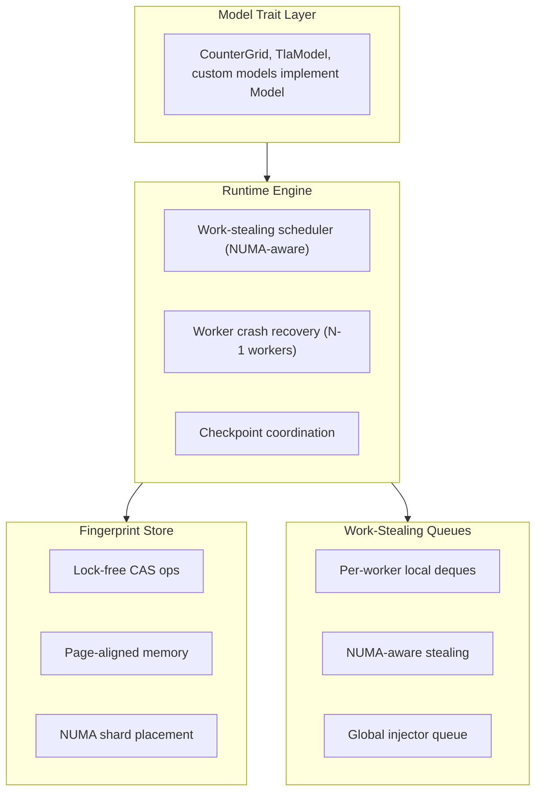

# CLAUDE.md

This file provides guidance to Claude Code (claude.ai/code) when working with code in this repository.

## Project Overview

`tlaplusplus` is a Rust implementation of TLA+ model checking, achieving **10.7x faster** state exploration than Java TLC on many-core systems (benchmarked on 128-core AMD EPYC, validated on 384-core systems with 6 NUMA nodes).

Key performance features:
- **Automatic NUMA-aware worker scaling** - detects NUMA topology and distances, auto-selects optimal worker count using only close NUMA nodes (distance ≤20)
- **NUMA-local memory allocation** - workers bind memory to their NUMA node via `set_mempolicy()`, achieving 99%+ user CPU (vs 60-70% without)
- **NUMA-aware work-stealing queues** - hierarchical stealing prefers same-NUMA-node workers, batch stealing reduces overhead
- **Lock-free fingerprint store** - atomic CAS operations, dynamic resize at 85% load
- **Zero-copy state handling** - Arc-wrapped collections avoid clone overhead
- **Batch fingerprint checking** - amortizes synchronization across 512+ states
- No GC pauses (native Rust memory management)
- Cgroup-aware worker sizing and memory budgeting

## Common Commands

### Build and Test

```bash
# Build release binary
cargo build --release

# Run all tests (756 tests)
cargo test --release

# Run with chaos/failpoint testing (776 tests)
cargo test --release --features failpoints

# Run with Z3-backed symbolic Init enumeration (T5)
# Requires: apt-get install libz3-dev clang libclang-dev
cargo test --release --features symbolic-init

# Differential gate vs TLC (13 curated specs)
scripts/diff_tlc.sh

# Compiled-vs-interpreted proptest equivalence (T2)
PROPTEST_CASES=2048 cargo test --release --test compiled_vs_interpreted

# State-graph snapshot tests (T3)
cargo test --release --test state_graph_snapshots

# Chaos soak (T11) — 1-hour release ritual, opt-in via --features failpoints
scripts/chaos_soak.sh --duration 3600 --swarm-mode auto

# Chaos smoke (T11.3) — 5-min CI-gate variant of the soak; runs on every
# PR + push to main via .github/workflows/chaos-smoke.yml. Same harness,
# shorter duration, fails CI on any divergence/hang or if < 6 of the 12
# failpoints fire.
scripts/chaos_smoke.sh

# Run fuzzing (requires nightly)
cargo +nightly fuzz run fuzz_tla_module
```

### Cargo features

- `failpoints` (default off) — enables fail-injection points for chaos testing.
- `symbolic-init` (default off) — enables Z3-backed symbolic enumeration of filtered record-set Init expressions (`{tup \in [f1: D1, ...] : Pred(tup)}`). Requires system libz3 (`libz3-dev`) and `clang` + `libclang-dev` for bindgen at build time. Falls back to brute-force for any unsupported predicate shape, so enabling the feature is always safe — it can only make Init enumeration faster, never slower in observable behaviour. Benchmarks: 10-41x speedup on the synthetic 5-field `TightCan` spec; unblocks specs that previously hit the eval budget on `>100M` Init candidates. See `RELEASE_1.0.0_LOG.md` `### T5` for details.

### Running Model Checks

```bash
# Run synthetic counter-grid model (stress testing)
./target/release/tlaplusplus run-counter-grid \
  --max-x 10000 --max-y 10000 --max-sum 20000

# Analyze a TLA+ spec
cargo run -- analyze-tla \
  --module /path/to/Spec.tla \
  --config /path/to/Spec.cfg
```

### TLC Corpus Validation

```bash
# Run language coverage corpus
scripts/tlc_check.sh

# Run full indexed corpus
scripts/tlc_corpus.sh

# Run public corpus entries
scripts/tlc_public_corpus.sh
```

## Architecture

### Core Components


```mermaid
flowchart TB
    subgraph Model["Model Trait Layer"]
        M["CounterGrid, TlaModel, custom models implement Model"]
    end

    subgraph Runtime["Runtime Engine"]
        R1["Work-stealing scheduler (NUMA-aware)"]
        R2["Worker crash recovery (N-1 workers)"]
        R3["Checkpoint coordination"]
    end

    subgraph FP["Fingerprint Store"]
        F1["Lock-free CAS ops"]
        F2["Page-aligned memory"]
        F3["NUMA shard placement"]
    end

    subgraph WS["Work-Stealing Queues"]
        W1["Per-worker local deques"]
        W2["NUMA-aware stealing"]
        W3["Global injector queue"]
    end

    Model --> Runtime
    Runtime --> FP
    Runtime --> WS
```

**1. Model Trait (`src/model.rs`)**
- Defines the interface all models must implement
- `Model::State` must be: Clone, Debug, Eq, Hash, Send, Sync, Serialize, DeserializeOwned
- Key methods: `initial_states()`, `next_states()`, `check_invariants()`

**2. Runtime Engine (`src/runtime.rs`)**
- Core parallel state exploration with N worker threads
- Uses `run_model()` as main entry point
- Coordinates workers, fingerprint store, state queues
- Worker crash recovery: continues with N-1 workers, redistributes work

**3. Storage Layer (`src/storage/`)**

**Lock-Free Fingerprint Store** (`page_aligned_fingerprint_store.rs`):
- Open-addressed hash table with atomic CAS operations
- 2MB page-aligned memory allocation for TLB efficiency
- NUMA-aware shard placement based on worker CPU affinity
- **Dynamic resize** at 85% load factor:
  - Seqlock coordination (odd = resizing, even = stable)
  - Atomic pointer swapping for lock-free table replacement
  - Readers spin-wait during resize, then retry
  - Tested at 192 workers, 20M states/sec throughput maintained during resize
- Graceful degradation under memory pressure

**Work-Stealing Queues** (`work_stealing_queues.rs`, `spillable_work_stealing.rs`):
- Per-worker lock-free deques (crossbeam-deque)
- Hierarchical NUMA-aware stealing:
  1. First try workers on same NUMA node (low latency, max 8 attempts)
  2. Then try remote NUMA nodes (max 1 attempt per node to minimize cross-NUMA traffic)
- Batch stealing via `steal_batch_and_pop()` reduces steal overhead
- Per-NUMA idle counters for O(NUMA_nodes) termination detection (vs O(workers))
- Cache-line padded counters to prevent false sharing
- Batch API: `push_local_batch()` for amortizing synchronization

**Memory Management & Disk Spilling**:
- **Automatic disk overflow**: When in-memory queue exceeds threshold (default 50M items), items spill to disk
- **Per-worker spill buffers** (4K items each) - workers accumulate locally, avoiding central lock contention
- **Async spill coordinator** - background thread batches items from all workers, writes segments to disk
- **Non-blocking spill path** - workers use `try_send()` with backpressure handling (if channel full, items stay in memory)
- **Backpressure**: If queue exceeds 1B pending states, workers skip successor generation to allow backlog processing
- **Checkpoint support**: Queue state can be persisted for crash recovery

**4. System Layer (`src/system.rs`, `src/storage/numa.rs`)**
- Cgroup-aware worker planning: reads `/sys/fs/cgroup` for cpuset and CPU quota
- NUMA topology detection from `/sys/devices/system/node`:
  - Discovers node count, CPU-to-node mappings, and inter-node distances
  - Auto-calculates optimal worker count based on NUMA distances (threshold ≤20)
  - On 6-NUMA-node systems, typically selects 3 close nodes for 2-4x better throughput
- NUMA-local memory binding via `set_mempolicy(MPOL_PREFERRED)` syscall
- CPU pinning via `sched_setaffinity`
- CPU list parsing (supports "2-127" or "2-63,96-127")
- Memory budget calculation from cgroup limits

**5. TLA+ Frontend (`src/tla/`)**

Native TLA+ parsing and evaluation:

**Parsing & Analysis**:
- `module.rs`: Parse TLA+ module structure (constants, variables, definitions, EXTENDS)
- `cfg.rs`: Parse `.cfg` files (CONSTANTS, INIT, NEXT, SPECIFICATION, invariants)
- `scan.rs`: Scan module closure for operator usage and language features

**Evaluation**:
- `value.rs`: TlaValue enum (Int, Bool, String, Set, Seq, Record, ModelValue, Function)
- `eval.rs`: Expression evaluator with support for operators, set operations, quantifiers
- `action_ir.rs`: Compile action definitions into intermediate representation (IR)
- `action_exec.rs`: Execute action IR to compute successor states

### Worker Architecture

Each worker runs in a tight loop with NUMA-aware work stealing:

1. **Fast path**: Pop from local queue (completely contention-free)
2. **Slow path** when local queue empty:
   - Try global injector queue
   - Try stealing from same-NUMA-node workers first
   - Try stealing from remote NUMA nodes
   - Exponential backoff with spin-loop hints
3. Check invariants (stop on violation if configured)
4. Compute successor states via `model.next_states()`
5. Batch fingerprint check via lock-free CAS
6. Enqueue unique states to local queue
7. Mark worker idle/active for termination detection
8. Exit when all workers idle AND all queues empty

### Termination Detection

Optimized termination without per-state atomic updates:
- Per-worker active flags (cache-line padded)
- Workers mark idle before stealing attempts
- Termination requires: all workers idle + global queue empty + all stealers empty

## Testing

The project includes:

- **120 unit tests** covering runtime, storage, and TLA+ evaluation
- **Property-based tests** (proptest) verifying set algebra laws
- **Chaos testing** with failpoints for fault injection
- **Fuzz targets** for TLA+ parser robustness

### Chaos Testing

Available failpoints (enable with `--features failpoints`):
```rust
- checkpoint_write_fail    // Fail checkpoint writes
- fp_store_shard_full      // Simulate fingerprint store pressure
- worker_panic             // Crash individual workers
- queue_spill_fail         // Fail queue disk operations
```

Recovery behaviors:
- **Worker crashes**: Continue with remaining workers, redistribute work
- **I/O failures**: Exponential backoff retry (3 attempts, 100ms-2s delays)
- **Memory pressure**: Graceful degradation, emergency checkpoints

### Chaos Soak (T11, pre-release ritual)

Single-shot failpoint tests catch "does this one fault recover" but not
"does the system survive 1000+ random faults over an hour." For 1.0.0 we
run a chaos soak as a manual pre-release step:

```bash
cargo build --release --features failpoints

# Single-failpoint baseline (T11): one random failpoint per iter
scripts/chaos_soak.sh --duration 3600

# Swarm mode (T16b): multiple concurrent failpoints per iter,
# surfaces fault-cascade bugs single-fault tests can't reach
scripts/chaos_soak.sh --duration 3600 --swarm-mode auto
```

The soak runs `tlaplusplus run-tla` against a target spec (default:
`corpus/internals/CheckpointDrain.tla`, ~26K distinct states) in a tight
loop. Each iteration sets `FAILPOINTS=<random-failpoint>=<random-action>`
(or `name1=action1;name2=action2;...` in swarm mode) where most actions
are transient (`1*return->off`, `2*return->off`) and a small fraction
permanent (`return`). It then checks the run's distinct state count and
invariant verdict against the no-failpoint control. The soak fails on
any state-count mismatch, hang, or panic-without-recovery.

`--swarm-mode` controls how many concurrent failpoints fire per iteration
(T16b — Regehr et al., ICST 2012, "Swarm Testing"):

- `--swarm-mode 1` (default) — one failpoint per iter (T11 baseline,
  backward-compatible).
- `--swarm-mode N` — exactly N concurrent failpoints per iter (clamped
  to catalog size 12).
- `--swarm-mode auto` — random N in `[1, --swarm-max]` (default
  `--swarm-max 4`) per iter. Recommended for finding fault-cascade bugs.

Real production faults often correlate (memory pressure spikes both
queue spill and FP-store resize); swarm mode reproduces this by enabling
2-4 failpoints simultaneously. The summary prints both the per-failpoint
fire counts and a top-N concurrent-pair coverage matrix so you can see
which failure combinations were exercised.

### Chaos Smoke (T11.3, per-PR CI gate)

The hour-long soak is a release ritual; it does not catch chaos
regressions on per-PR commits. `scripts/chaos_smoke.sh` is a thin
wrapper that delegates to `chaos_soak.sh` with smoke parameters
(5-minute duration, 30-second per-iter timeout, swarm-mode auto,
2 workers) and adds a coverage gate: it parses
`.chaos-smoke/iterations.tsv` and fails CI unless `>= 6` of the 12
catalog failpoints actually fire. Wired into
`scripts/REDACTED` (run on a fresh EC2 spot per push) to run on every PR + push to main.

```bash
cargo build --release --features failpoints
scripts/chaos_smoke.sh                          # 5 min, gate >= 6 failpoints
scripts/chaos_smoke.sh --min-failpoints 10      # tighter gate
scripts/chaos_smoke.sh --duration 600           # longer smoke
```

Validated on a 2-vCPU spot: 5m17s wall, 21 iterations, 12/12 failpoints
exercised, 0 divergences, 0 hangs. Total CI budget ~10 min including
the failpoints build.

Wired in `src/main.rs::main()` under `cfg(feature = "failpoints")`:
`fail::FailScenario::setup()` is called so the standard `FAILPOINTS` env
var configures failpoints for the spawned process. The `fail` crate
parses `;` as the per-failpoint config delimiter.

## Performance Tuning

Key parameters for many-core systems:

| Parameter | Default | Description |
|-----------|---------|-------------|
| `--workers` | auto | Worker count (0 = auto from NUMA topology) |
| `--core-ids` | all | CPU list (e.g., "2-127") |
| `--numa-pinning` | true | Enable NUMA-aware CPU binding |
| `--auto-tune` | true | Dynamically adjust active workers based on CPU sys% |
| `--fp-shards` | auto | Fingerprint store shard count (0 = auto) |
| `--fp-expected-items` | 100M | Expected distinct states (increase for large models) |
| `--fp-batch-size` | 512 | States per fingerprint batch |
| `--checkpoint-interval-secs` | 0 | Checkpoint frequency (0 = disabled) |
| `--queue-max-inmem-items` | 50M | Max items in memory before spilling to disk |
| `--disable-queue-spilling` | false | Disable disk spilling (memory only) |

### NUMA Optimization (Many-Core Systems)

On systems with multiple NUMA nodes (e.g., 384-core with 6 NUMA nodes):

- **`--workers 0`** (default): Auto-detects NUMA topology and selects workers only from close NUMA nodes (distance ≤20). On a 6-node system, typically uses 3 nodes = 192 workers instead of 384.
- This achieves **99%+ user CPU** vs 60-70% when using all NUMA nodes
- Cross-NUMA memory access causes 20-38% kernel time; NUMA-local allocation eliminates this

Example NUMA distances (from `numactl --hardware`):
```
node   0   1   2   3   4   5
  0:  10  15  17  21  28  26   <- nodes 0,1,2 are "close" (≤20)
  3:  21  28  26  10  15  17   <- nodes 3,4,5 are "close" to each other
```

### Auto-Tuning (Enabled by Default)

The auto-tuner (`--auto-tune=true`) monitors `/proc/stat` and dynamically adjusts active worker count:

- **Target**: Keep kernel (sys%) time below 20%
- **High sys%** indicates lock/atomic contention → reduces active workers
- **Low sys%** → tries adding workers back
- Uses hysteresis (±5%) to prevent oscillation
- Workers over the target yield briefly (100µs) rather than spin

### Benchmark Results (384-core EC2, 6 NUMA nodes)

Tested on Combined.tla (complex TLA+ model):

| Configuration | Workers | User CPU | Sys CPU | Throughput |
|---------------|---------|----------|---------|------------|
| Before optimizations | 384 | 48% | **51%** | ~120K states/s |
| All workers, optimized | 384 | **97.5%** | 2.1% | ~100K states/s |
| NUMA-optimized (auto) | 192 | **99%*** | **0.6%** | **~220K states/s** |

*Per-active-core utilization (192 workers use 50% of total cores)

**Key finding**: NUMA-optimized worker selection (`--workers 0`) achieves **2x higher throughput** by using only workers on close NUMA nodes, eliminating cross-NUMA memory access overhead.

### Scalability Optimizations

The following optimizations reduce kernel time from 51% to <1%:

1. **Per-worker fingerprint cache** (64K entries per worker)
   - Catches duplicate fingerprints locally before hitting global CAS operations
   - ~512KB memory overhead per worker
   - Eliminates most global store traffic after cache warmup

2. **Worker-shard affinity for fingerprint batches**
   - Workers process shards in staggered order (worker N starts at shard N % num_shards)
   - Reduces probability of simultaneous CAS on same shard
   - Spreads contention across time

3. **Adaptive stats flush** (count OR time-based)
   - Flushes every 512 states OR every ~1 second
   - Balances atomic contention reduction vs stats freshness
   - Ensures accurate progress reporting for slow models

4. **NUMA-local memory binding**
   - Workers bind memory allocation to their NUMA node via `set_mempolicy()`
   - Eliminates cross-NUMA memory access (140ns → 60ns latency)

### Memory Exhaustion Handling

When memory fills up, the system gracefully degrades:

1. **Queue spilling** (default: enabled)
   - When in-memory queue exceeds `--queue-max-inmem-items` (default 50M), items overflow to disk
   - Per-worker spill buffers (4K items) avoid lock contention during overflow
   - Background coordinator writes batches asynchronously
   - Items reload from disk automatically when memory frees up

2. **Backpressure**
   - If queue exceeds 1B pending states, workers pause successor generation
   - Allows workers to process backlog without deadlock
   - Automatically resumes when queue drains below threshold

3. **Fingerprint store resize**
   - Shards resize at 85% load factor (configurable)
   - Seqlock coordination allows lock-free reads during resize
   - Workers spin-wait briefly during resize, then continue

4. **Emergency checkpoints**
   - On memory pressure signals, triggers checkpoint to persist state
   - Allows resumption after restart with more memory

### Checkpoint and Recovery

Periodic checkpoints (`--checkpoint-interval-secs`) persist state for crash recovery:

**Checkpoint process:**
1. Workers pause at designated pause points
2. In-memory queue items drain to disk (creates segment files)
3. Fingerprint store flushes to disk
4. Manifest written with state counts and metadata
5. Workers resume, loader thread reloads items from disk

**Post-checkpoint throughput recovery:**
- Loader thread refills queue from disk segments (100K items/batch)
- Workers wait for pending disk work before terminating
- Maintains ~6M states/min throughput after checkpoint (vs ~500K without fixes)
- Key mechanisms:
  - `adjust_counters_after_drain()` keeps `pending_count()` accurate
  - Workers check `has_pending_work()` before breaking from main loop
  - Aggressive loading (no sleep between batches) when queue < 500K items

## Current Status (v1.0.0)

**Working (TLC feature parity + 1.0.0 additions)**:

Test suite & gates:
- **756 default tests**, 0 failures, 8 ignored (`cargo test --release`)
- **776 tests with `--features failpoints`**, 0 failures
- **774 tests with `--features symbolic-init`**, 0 failures
- **13/13 differential-vs-TLC specs** pass via `scripts/diff_tlc.sh` (state counts agree exactly with TLC v2.19); CI gate via `scripts/REDACTED` (run on a fresh EC2 spot per push) runs on a `[ubuntu-latest, ubuntu-24.04-arm]` cross-arch matrix
- **T2 proptest equivalence**: compiled-vs-interpreted on Int/Bool/Set/Seq/Record/Str expressions, clean across 9 seeds at `PROPTEST_CASES=2048`; CI runs at 128
- **T16a swarm proptest**: random subset of 17 shape categories per case (Regehr-style); kept alongside the uniform regression
- **State-graph snapshot tests**: 12 active snapshots for 7 small TLA+ specs, validated against TLC v2.19
- **17 community modules** (DyadicRationals, SequencesExt, Functions, Folds, FiniteSetsExt, UndirectedGraphs, Graphs, Relation, Bags, BagsExt, IOUtils, Bitwise, Combinatorics, CSV, VectorClocks, Randomization, plus proof modules)
- **174/182 (95.6%) tlaplus/Examples corpus** pass at 60s on v0.3.0 baseline; v1.0.0 carries the same compatibility surface
- 19 property tests, 23 chaos tests, 8 fuzz targets

Runtime & checking:
- Parallel runtime with NUMA-aware work-stealing (10.7x faster than TLC on synthetic; up to 22x on NUMA-optimized configs)
- Lock-free fingerprint storage with atomic CAS and dynamic resize
- Native TLA+ frontend with full language coverage
- Safety invariant checking, liveness/fairness checking (T10: ~550x faster fairness post-processing), deadlock detection
- ENABLED operator (including parameterized actions)
- Symmetry reduction (wired into runtime fingerprinting)
- **Partial-order reduction (T7)** — opt-in `--por`, stubborn-set with static dependency analysis; safety-only (auto-rejects when fairness/liveness present); benchmark on PorBenchProcessGrid 36.8x state reduction, 17.9x wall-time speedup
- **Symbolic Init enumeration (T5)** — opt-in `--features symbolic-init`, Z3-backed enumeration of filtered record-set Init shapes; 10-41x on TightCan
- **State compression in queue (T8)** — default-on zstd-compressed in-memory ring sits between hot work-stealing deques and disk overflow; 13.2x ratio, -68% peak RSS at 1M items, +2% wall time; opt-out via `--queue-compression false`
- **Trace minimization (T9)** — default-on `--minimize-trace`; Phase A (truncation + BFS shortcut to fixed point) + Phase B (variable-relevance highlighting); 30s budget
- Simulation mode (`--simulate`)
- BFS parent tracking for full error traces (`--trace-parents`)
- Diff traces (`--difftrace`), coverage profiling (`--coverage`)
- Continue after violation (`--continue --max-violations N`)
- State graph dump (`--dump FILE`)
- ASSUME evaluation at startup
- S3 checkpoint/resume for spot instance resilience
- FLURM integration with `--fetch-module`/`--fetch-config` for distributed runs
- Constraint propagation for filtered record set Init enumeration
- Lazy Init enumeration for large cross-products (>10M states)
- Evaluation budget to prevent exponential blowup in analysis

Distributed:
- Cross-node TCP work-stealing protocol (T6); opt-in `--cluster-listen`. Cluster mode kept opt-in for v1.0.0 — see `RELEASE_1.0.0_LOG.md` `### T6.1` for the cluster-vs-independent benchmark and the rationale.

Verification:
- Verus tier-B proof of the seqlock resize protocol (T13). 19 lemmas verified by Z3, including the headline `theorem_no_fingerprint_lost`. Lives at `verification/verus/seqlock_resize.rs`; run via `verification/verus/run_proof.sh`.
- Verus tier-A extension (T13.1-T13.3). 31 lemmas verified over a `Seq<u64>` linear-probe model with spec-level CAS soundness and bounded reader-retry termination. Lives at `verification/verus/seqlock_resize_tier_a.rs`; run via `verification/verus/run_proof.sh tier-a`.
- Verus tier-A.5 production-shape shadow (T13.4 partial). 17 verified items modeling `FingerprintShard`'s hot-path methods with real Verus tracked permissions (`PAtomicU64` + `Tracked<&PermissionU64>`). Lives at `verification/verus/shard_methods.rs`; run via `verification/verus/run_proof.sh shard-methods`.
- Verus reader-liveness (T13.3 + T13.5). Unbounded-fairness liveness theorem `theorem_no_starvation` over a temporal trace model; both safety and liveness sides fully proved with 0 axioms. The constructive proof (`verification/verus/reader_liveness_v2.rs`, 17 verified, 0 errors via `./run_proof.sh reader-liveness-v2`) replaces the three previous protocol-shape axioms with explicit short-`seq!` witnesses (2- and 3-element extensions). The original `verification/verus/reader_liveness.rs` (14 verified plus 3 documented `external_body` axioms) is preserved as the bounded-form temporal-trace fallback and reference for the eventual `state_machines!` port.
- CI gate (T13.6). `scripts/REDACTED` (run on a fresh EC2 spot per push) builds Verus from source on `ubuntu-latest`, caches the build keyed on the pinned upstream ref, and runs all four proof files (tier-B, tier-A, shard-methods, liveness) on push to main + PR. Aarch64 runs as a manual `workflow_dispatch` job (informational, not a gate) due to upstream Z3 packaging issues on hosted aarch64 runners.

Chaos & swarm:
- 1-hour chaos soak (`scripts/chaos_soak.sh`) covers all 12 failpoints in `src/chaos.rs`; 0 divergences, 0 hangs in the v1.0.0 release run.
- Swarm-mode chaos (`--swarm-mode N|auto`, T16b) injects 1-4 concurrent failpoints per iteration; runtime tolerates 4-fold simultaneous fault injection.

<<<<<<< HEAD
Deferred to v1.1.0:
- T5.5: Joint Init+Solution symbolic encoding (Einstein-class workloads). T5.4 (streaming Init enumeration) landed in v1.1.0.
=======
Landed in v1.1.0:
- T11.3: per-PR chaos smoke (`scripts/chaos_smoke.sh`, `scripts/REDACTED` (run on a fresh EC2 spot per push)).
- T11.4: `route_spill_batch` Err-branch inflight leak fix; permanent disk failures
  (real or `queue_spill_fail=return` failpoint) now release `inflight_spilled`
  and account dropped items in `QueueStats::spill_lost_permanently`.

Deferred to v1.1.x:
- T5.4, T5.5: Streaming Init enumeration, joint Init+Solution symbolic encoding (Einstein-class workloads).
>>>>>>> worktree-agent-ad795be698325d7cd
- T10.2: Streaming SCC discovery for 100M+ liveness.
- T13.4 (full): Verus tracked-pointer integration of the production `FingerprintShard` (the shadow methods in `shard_methods.rs` are the working blueprint).
- T13.5 (`state_machines!` port): the constructive proof in `reader_liveness_v2.rs` discharges the headline `theorem_no_starvation` with 0 axioms; an LTL-native restatement via `state_machines!` is optional polish, no longer load-bearing.
- See `RELEASE_1.0.0_PLAN.md` for the full v1.1.x backlog.

## Key Implementation Notes

### Model Implementation Pattern

Synthetic models live in `src/models/`. To add a new model:

1. Implement the `Model` trait
2. Define `State` as a concrete type with `#[derive(Clone, Debug, Eq, PartialEq, Hash, Serialize, Deserialize)]`
3. Add subcommand to `src/main.rs` with model-specific parameters
4. Use `build_engine_config()` + `run_model()` pattern

### TLA+ Integration Pattern

The bridge from `.tla` to `Model` trait:

1. Parse module with `parse_tla_module_file()`
2. Parse config with `parse_tla_config()`
3. Seed initial state from `Init` using `classify_clause()` + `eval_expr()`
4. Implement `next_states()` using `evaluate_next_states()` on `Next` body
5. Implement invariant checks using `eval_expr()` on invariant formulas

## Code Organization Principles

- **Lock-free where possible**: Atomic CAS operations, per-worker local state
- **NUMA-aware**: Hierarchical stealing, shard placement by CPU affinity
- **Cache-friendly**: Cache-line padded structures, batch operations
- **Separation of concerns**: Runtime independent of storage and model semantics
- **Graceful degradation**: Falls back to reasonable defaults if cgroup/NUMA unavailable
- **Type safety**: Newtypes and enums (TlaValue) catch errors at compile time

## Corpus and Validation

The repository includes TLC corpus validation:
- `corpus/index.tsv`: Corpus run index
- `corpus/public/`: Public corpus source list and lockfile
- `tools/tla2tools.jar`: Vendored official TLC jar (v1.7.4)
- Scripts produce summary TSV and per-run logs under `.tlc-out/`

Use corpus validation to ensure compatibility as the native frontend evolves.
