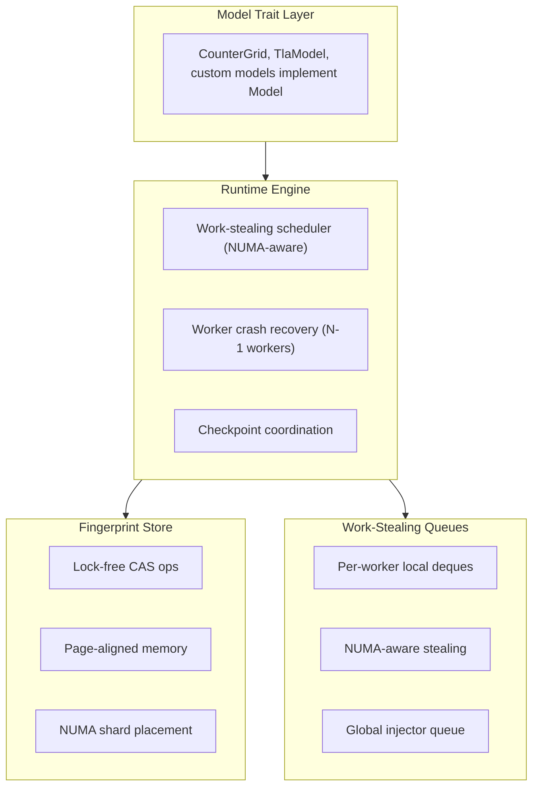

# tlaplusplus

A Rust implementation of TLA+ model checking, achieving **10.7x faster** state exploration than Java TLC on many-core systems.

## Performance

Benchmarked on 128-core AMD EPYC (c6a.metal, 256GB RAM):

| Metric | tlaplusplus | Java TLC | Speedup |
|--------|-------------|----------|---------|
| States/minute | 10.5M | 980K | **10.7x** |
| CPU utilization | 95%+ | ~60% | - |
| Memory efficiency | Lock-free | GC pauses | - |

Key optimizations:
- **NUMA-aware work-stealing queues** - hierarchical stealing prefers same-NUMA-node workers
- **Lock-free fingerprint store** - atomic CAS operations eliminate lock contention
- **Zero-copy state handling** - Arc-wrapped collections avoid clone overhead
- **Batch fingerprint checking** - amortizes synchronization across 512+ states

## Features

- **Parallel state exploration** with N worker threads (auto-detected from cgroup/NUMA topology)
- **Lock-free fingerprint store** with page-aligned memory and NUMA-aware shard placement
- **Work-stealing queues** for dynamic load balancing across workers
- **NUMA-aware CPU pinning** via `sched_setaffinity`
- **Cgroup-aware resource limits** - respects cpuset and CPU quota
- **Checkpoint/resume** for long-running model checks
- **Native TLA+ frontend** for direct `.tla` file execution

## Build

```bash
cargo build --release
```

## Quick Start

```bash
# Run synthetic stress test model
./target/release/tlaplusplus run-counter-grid \
  --max-x 10000 --max-y 10000 --max-sum 20000

# Analyze a TLA+ spec
cargo run -- analyze-tla \
  --module /path/to/Spec.tla \
  --config /path/to/Spec.cfg
```

## Testing

```bash
# Run all tests (103 tests)
cargo test

# Run with chaos/failpoint testing
cargo test --features failpoints

# Run property-based tests
cargo test proptests

# Run fuzzing (requires nightly)
cargo +nightly fuzz run fuzz_tla_module
```

The test suite includes:
- **103 unit tests** covering runtime, storage, and TLA+ evaluation
- **Property-based tests** (proptest) verifying set algebra laws
- **Chaos testing** with failpoints for fault injection
- **Fuzz targets** for TLA+ parser robustness

## Architecture

### Core Components



### Storage Layer

**Lock-Free Fingerprint Store** (`page_aligned_fingerprint_store.rs`):
- Open-addressed hash table with atomic CAS operations
- 2MB page-aligned memory allocation for TLB efficiency
- NUMA-aware shard placement based on worker CPU affinity
- Graceful degradation under memory pressure

**Work-Stealing Queues** (`work_stealing_queues.rs`):
- Per-worker lock-free deques (crossbeam-deque)
- Hierarchical stealing: prefer same-NUMA node, then remote
- Cache-line padded counters to prevent false sharing
- Automatic termination detection

### TLA+ Frontend

Native TLA+ parsing and evaluation (in progress):
- Module parser with EXTENDS resolution
- Config file parser (CONSTANTS, INIT, NEXT, invariants)
- Expression evaluator for TLA+ operators
- Action IR compiler and executor

## Chaos Testing

The project includes fault injection for reliability testing:

```rust
// Available failpoints (enable with --features failpoints)
- checkpoint_write_fail    // Fail checkpoint writes
- fp_store_shard_full      // Simulate fingerprint store pressure
- worker_panic             // Crash individual workers
- queue_spill_fail         // Fail queue disk operations
```

Recovery behaviors:
- **Worker crashes**: Continue with remaining workers, redistribute work
- **I/O failures**: Exponential backoff retry (3 attempts, 100ms-2s delays)
- **Memory pressure**: Graceful degradation, emergency checkpoints

## TLC Corpus Validation

```bash
# Run language coverage corpus
scripts/tlc_check.sh

# Run full indexed corpus
scripts/tlc_corpus.sh

# Run public corpus entries
scripts/tlc_public_corpus.sh
```

## Configuration

Key parameters for many-core systems:

| Parameter | Default | Description |
|-----------|---------|-------------|
| `--workers` | auto | Worker count (0 = auto from cgroup) |
| `--core-ids` | all | CPU list (e.g., "2-127") |
| `--numa-pinning` | true | Enable NUMA-aware CPU binding |
| `--fp-shards` | 64 | Fingerprint store shard count |
| `--fp-batch-size` | 512 | States per fingerprint batch |
| `--checkpoint-interval-secs` | 0 | Checkpoint frequency (0 = disabled) |

## Current Status

**Working**:
- Parallel runtime with work-stealing
- Lock-free fingerprint storage
- NUMA-aware resource management
- 103 tests, property tests, fuzzing
- Fault injection testing

**In progress**:
- Native TLA+ frontend (direct `.tla` execution)
- Full TLA+ language coverage

**Not yet implemented**:
- Temporal/liveness checking
- Symmetry reduction

## License

MIT
